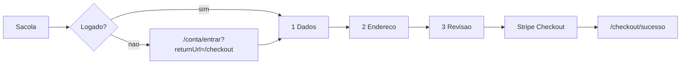

# Checkout em 3 passos (somente logado)

Fluxo da loja Leonardo Chiasso: dados e endereço na storefront; cartão no **Stripe Checkout hospedado**.

## Diagrama



## UX (steps)

| Passo | Rota / UI | Campos | Ação |
|-------|-----------|--------|------|
| 1 · Dados | `/checkout` | nome, e-mail, CPF, telefone | `PATCH /api/account/profile` |
| 2 · Endereço | mesmo wizard | CEP…UF; cadastrado **ou** novo | opcional `POST /api/account/addresses` |
| 3 · Pagamento | revisão | sem PAN | `POST /api/checkout/sessions` → redirect Stripe |

Design de referência: [`docs/design/checkout-frames.md`](design/checkout-frames.md) (frames *Checkout / 01 Dados*, *02 Endereço*, *03 Pagamento*).

## Auth

- Sacola **Finalizar compra** → `/checkout` se logado; senão `/conta/entrar?returnUrl=/checkout`.
- Guard `customerAuthGuard` na rota `/checkout`.
- `POST /api/checkout/sessions` exige `CustomerGuard` (cookie `lc_session`).

## API

| Method | Path | Body (resumo) |
|--------|------|----------------|
| GET/PATCH | `/api/account/profile` | name, email, cpf, phone |
| GET/POST/PATCH/DELETE | `/api/account/addresses` | CEP, street, number, … |
| POST | `/api/checkout/sessions` | `items`, `cpf`, `phone`, `addressId` **ou** `address`, `idempotencyKey?` |
| GET | `/api/checkout/orders/:publicCode` | status pós-pagamento |
| POST | `/api/webhooks/stripe` | raw body + signature |

Pedido grava snapshot: `buyerName/Email/Cpf/Phone`, `shippingAddress` (JSON). Stripe metadata: `orderId`, `publicCode`, `cpfLast4` (nunca CPF completo).

## Env

```
STRIPE_SECRET_KEY=sk_test_…
STRIPE_WEBHOOK_SECRET=whsec_…
STOREFRONT_URL=http://localhost:4200
```

## Como testar

1. API + Postgres; `npx prisma migrate deploy` (migration `checkout_profile_addresses`).
2. Storefront `ng serve`; login (ou `ENABLE_DEV_LOGIN=true` + botão dev).
3. Adicionar item → Finalizar compra → preencher wizard → Pagar com cartão.
4. Webhook local: `stripe listen --forward-to localhost:3000/api/webhooks/stripe` e colar o `whsec_` em `.env`.
5. Cartão teste Stripe (`4242…`); retorno em `/checkout/sucesso?code=LC-…` limpa itens comprados e o draft do wizard.

## LGPD

CPF e telefone têm finalidade de **checkout / entrega / NF**. Persistidos no perfil e no snapshot do pedido. Não enviar CPF completo a terceiros (Stripe recebe só últimos 4 dígitos em metadata, se necessário). Política: `/legal/privacidade`.
